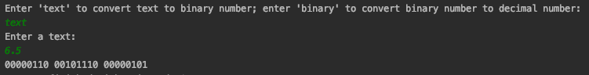
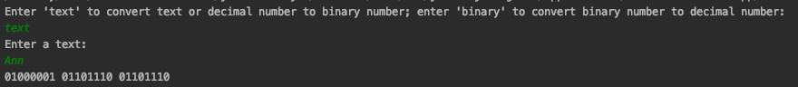
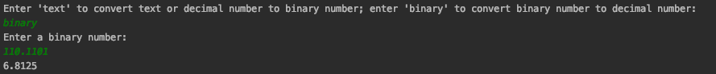

**Description**

This was one of my homework exercises for my course SEIS602 - Intermediate Software Development.

This Java application can take in a string, a decimal number, or a decimal fraction, and convert it to binary numbers. It can also take in binary numbers or binary fractions, and convert them to decimal numbers.

**Instruction**

* Download the source code and configure it in your Java IDE. IntelliJ IDEA IDE is recommended.

**Output**

* Convert a string to binary numbers

* Convert a decimal fraction to binary numbers

* Convert a binary fraction to decimal fractions

