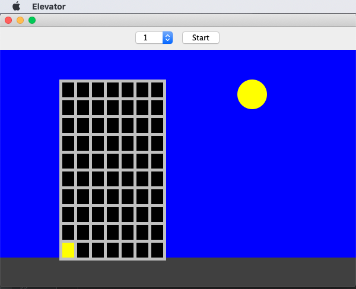

**Description**

This was one of my projects for my course CSCI1130 - Introduction to Programing in Java at North Hennepin Community College in Fall 2019.

This Java GUI application will allow users to select the floor which they prefer to go to, and the elevator represented by a highlighted window will go to that floor.

**Instruction**

* Download the source code and configure it in your Java IDE. IntelliJ IDEA IDE is recommended.

**Output**

* Initial Elevator interface

* Select the floor you want to go to

* Click Start button and the highlighted window will change to the selected floor

