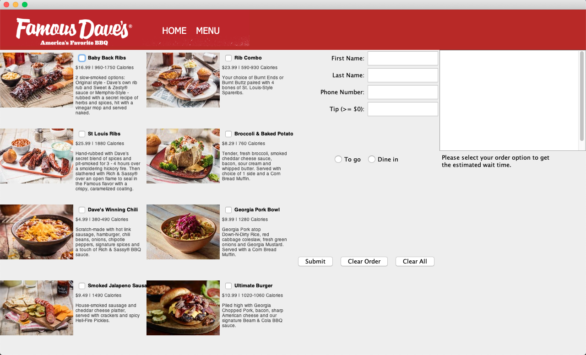
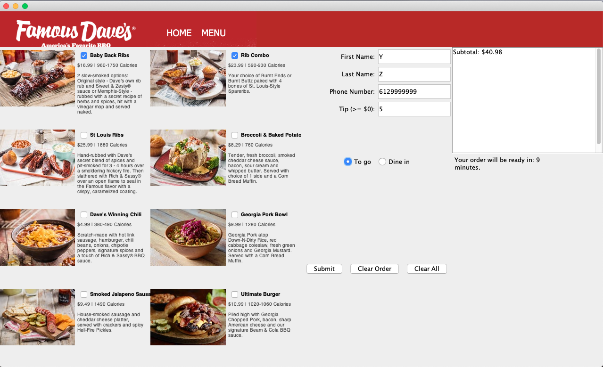
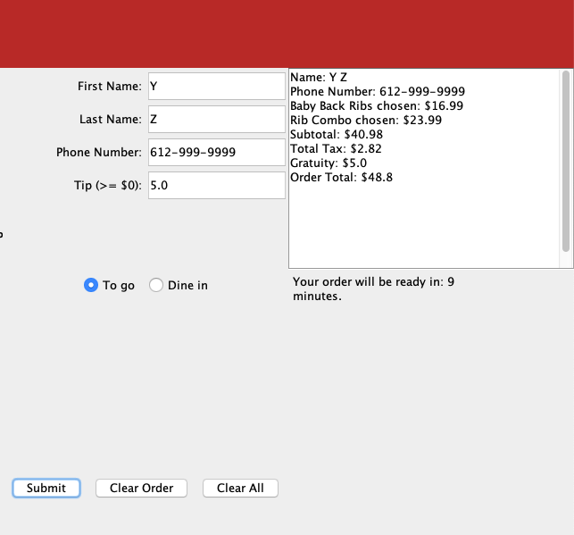
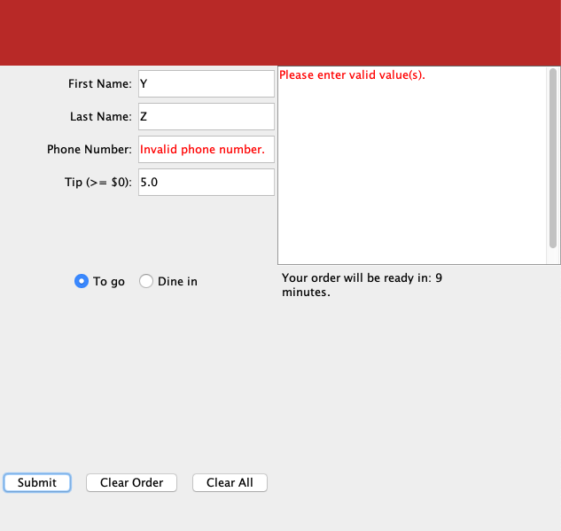
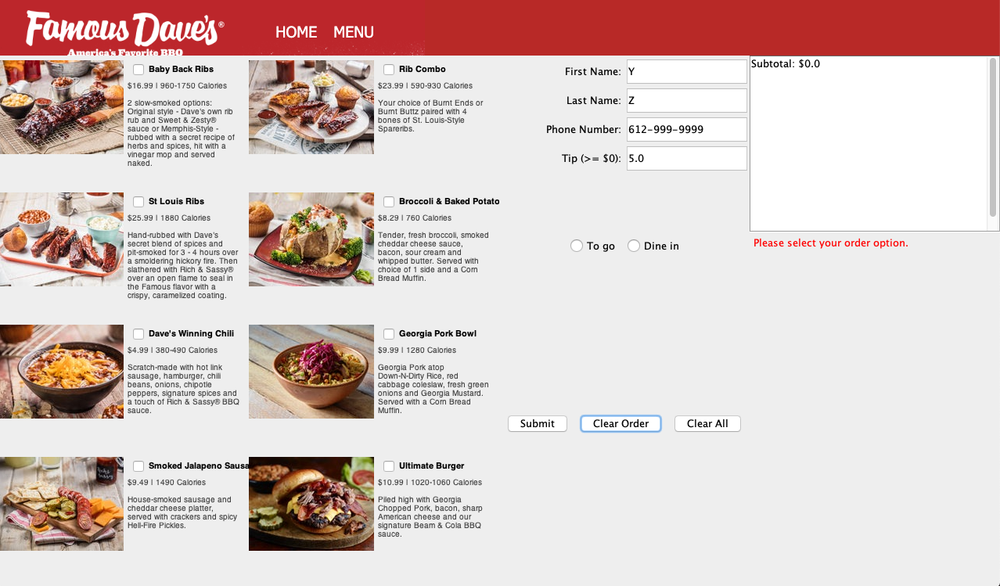
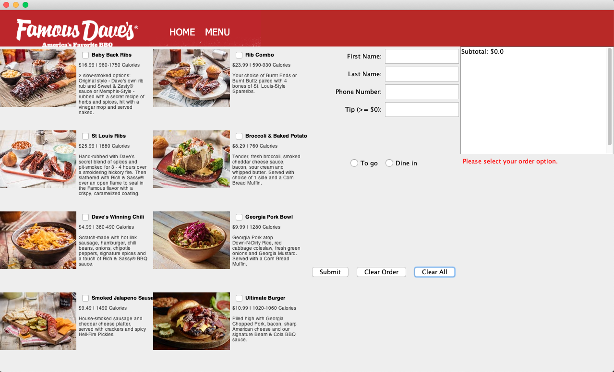

**Description**

This was my final project for my course CSCI1130 - Introduction to Programing in Java at North Hennepin Community College in Fall 2019.

This Java GUI application will allow customers to order food from one of my favorite restaurants, Famous Dave's, and get estimated wait time and prices for their orders.

**Instruction**

* Download all the source code and run Main.java in one of the Java IDE. IntelliJ IDEA IDE is recommended.

**Output**

* Initial Restaurant Online Ordering interface

* Select the dishes you'd like to order
* Enter your personal information and tip amount on the right side
* Choose your order option either to-go or dine-in
* The aggregated subtotal of your order will be generated in the receipt panel on the right

* When you press the **Submit** button, the **Phone Number** field will be reformatted and updated, and a receipt will be generated on the receipt panel.

* If an invalid phone number is entered, error messages will pop up.

* When you press the **Clear Order** button, all the selections on the checkboxes and radio buttons will be gone. The receipt panel will be erased, but your input personal information will still be there.

* When you press the **Clear All** button, everything will be cleared and reset. 

