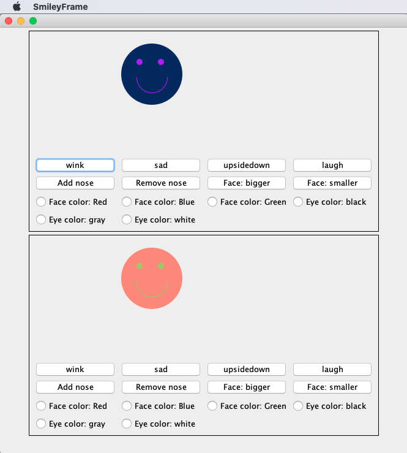
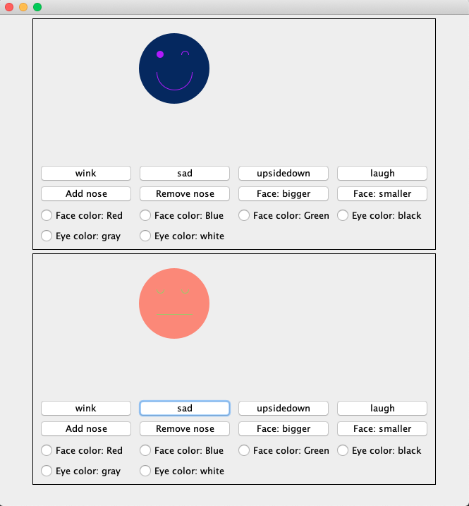
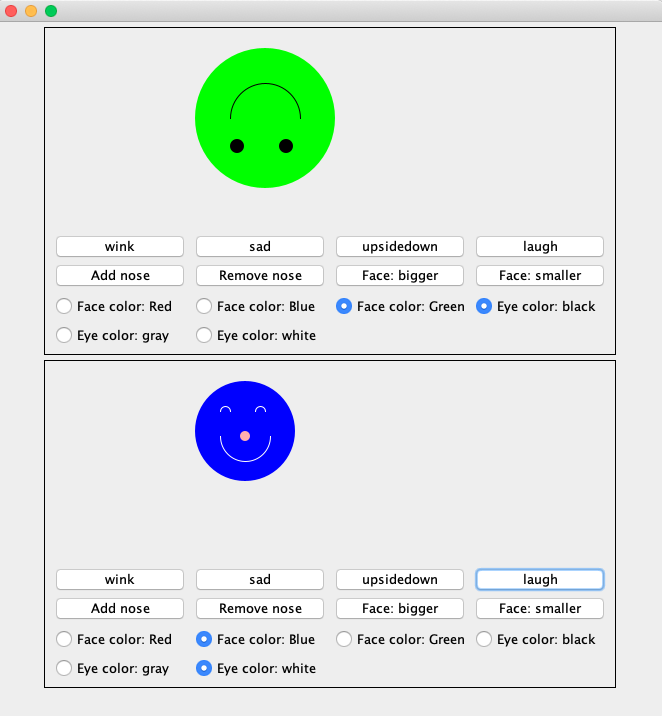

**Description**

This was one of my projects for my course CSCI1130 - Introduction to Programing in Java at North Hennepin Community College in Fall 2019.

This Java GUI application will allow users to create multiple smiley objects and modify them by choosing various methods and attributes, such as wink, laugh, the color of the eyes of the smiley faces, and so on.

**Instruction**

* Download the source code and configure it in your Java IDE. IntelliJ IDEA IDE is recommended.

**Output**

* Initial Smiley interface with two smiley objects

* First smiley object: choose **wink** method
* Second smiley object: choose **sad** method

* First smiley object: choose **upsidedown** and **Face: bigger** methods, change the face color to green and eye color to black
* Second smiley object: choose **laugn** and **Add nose** methods, change face color to blue and eye color to white

