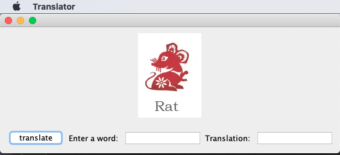
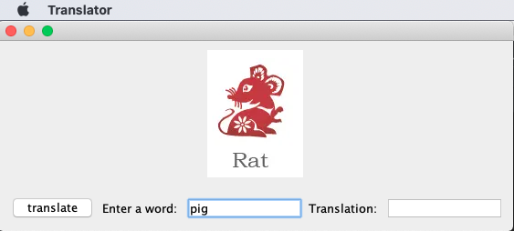
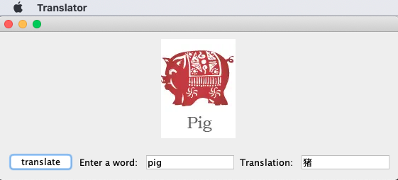
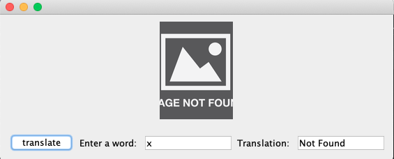

**Description**

This was one of my projects for my course CSCI1130 - Introduction to Programing in Java at North Hennepin Community College in Fall 2019.

This Java GUI application will translate the English word that a user enters from the list of 12 Chinese Zodiac to Chinese characters, and display an image representing the word accordingly. If other word is entered, then an error image will pop up.

**Instruction**

* Download the source code and configure it in your Java IDE. IntelliJ IDEA IDE is recommended.

**Output**

* Initial interface

* Enter the word **Pig** in the JTextField

* Press **translate** button, and the Chinese character **猪**, as well as an image of pig, showed up

* If the user input word is outside the translation array, then an error message **Not Found** and an error image will pop up.

