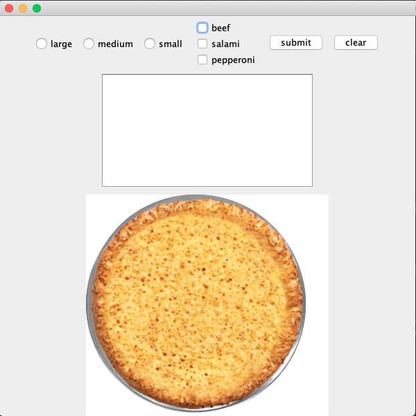
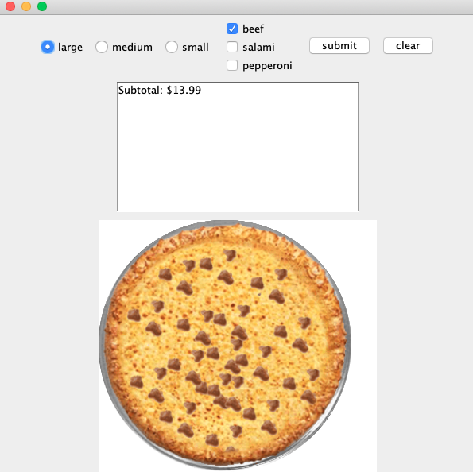
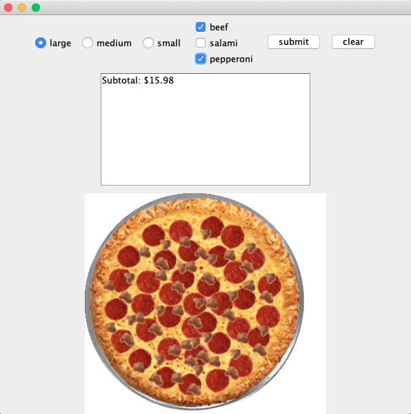
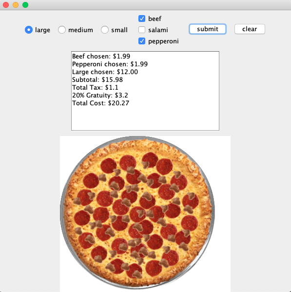

**Description**

This was one of my projects for my course CSCI1130 - Introduction to Programing in Java at North Hennepin Community College in Fall 2019.

This Java GUI application will allow a user to select, change, submit, and clear a pizza order with his or her preferences, and calculate the estimated prices of the pizza order.

**Instruction**

* Download the whole project folder and run it in one of the Java IDE. IntelliJ IDEA IDE is recommended.

**Output**

* Initial Pizza Ordering interface

* Select the size of the pizza and add one topping

* Add another topping

* Submit the pizza order and get a receipt with calculated a detailed bill

