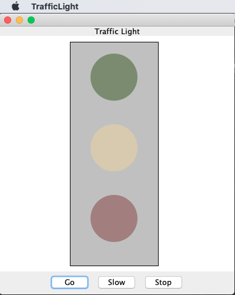
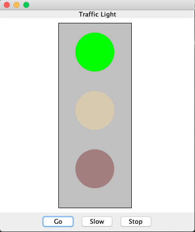
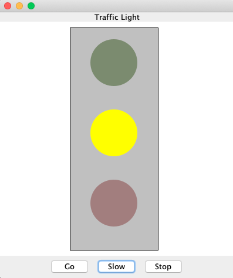
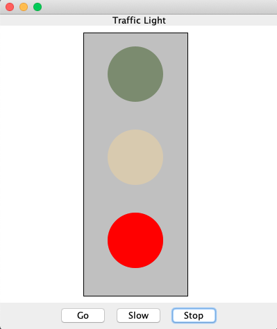

**Description**

This was one of my projects for my course CSCI1130 - Introduction to Programing in Java at North Hennepin Community College in Fall 2019.

This Java GUI application will display highlighted color  pressing buttons.

**Instruction**

* Download the source code and configure it in your Java IDE. IntelliJ IDEA IDE is recommended.

**Output**

* Initial interface

* Press **Go** button

* Press **Slow** button

* Press **Stop** button

